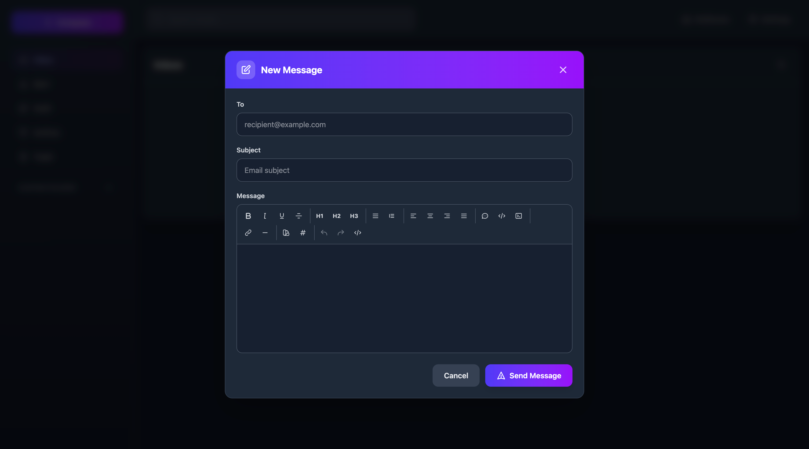

<div align="center">
  <a href="#">
    <h1 style="font-size: 4rem;">📧</h1>
    <h1>Email Explorer (多言語対応フォーク)</h1>
  </a>
</div>

<p align="center">
    <em>A modern, full-stack email client running entirely on Cloudflare Workers</em>
</p>

> **このリポジトリについて**
> 本リポジトリは [G4brym/email-explorer](https://github.com/G4brym/email-explorer)（MIT License）を元にした多言語対応（i18n）フォークです。
> オリジナルの著作権表示・ライセンス条項は `LICENSE` ファイルにそのまま保持しています。多言語化は本フォークで追加した変更です。

## 多言語対応について

画面は **46言語** で使えます。日本語を既定とし、ログイン画面を含むどの画面からでも右上のセレクタで切り替えられます（選択はブラウザに保存されます）。

対象は、日本語と、EUの公用語24言語、南アジア13言語、東南アジア8言語です。「どの言語が重要か」という判断ではなく、地域ごとに線を引いて機械的に決めています。後から見て検証できる基準のほうが、好みで選んだ一覧より維持しやすいためです。

| 地域 | 言語 |
|---|---|
| 東アジア | 日本語 |
| ヨーロッパ（EU公用語24） | Български, Čeština, Dansk, Deutsch, Ελληνικά, English, Español, Eesti, Suomi, Français, Gaeilge, Hrvatski, Magyar, Italiano, Lietuvių, Latviešu, Malti, Nederlands, Polski, Português, Română, Slovenčina, Slovenščina, Svenska |
| 南アジア | বাংলা, ગુજરાતી, हिन्दी, ಕನ್ನಡ, മലയാളം, मराठी, नेपाली, ଓଡ଼ିଆ, ਪੰਜਾਬੀ, සිංහල, தமிழ், తెలుగు, اردو |
| 東南アジア | Filipino, Bahasa Indonesia, ខ្មែរ, ລາວ, Bahasa Melayu, မြန်မာ, ไทย, Tiếng Việt |

各言語の短い概要を [`docs/readme/`](docs/readme/README.md) に1言語1ファイルで置いています。README全文の翻訳ではありません。全文を46言語ぶん維持するのは現実的ではなく、古びた訳文が並ぶくらいなら短くても正しいほうがよいと判断しました。

### 実装上の約束ごと

- ダッシュボード（`packages/dashboard`）は [vue-i18n](https://vue-i18n.intlify.dev/) を使用しています。翻訳文字列は `packages/dashboard/src/locales/<code>.json` に1言語1ファイルで置き、キー構成は `en.json` と完全に一致させます（1言語あたり312キー）。
- **選択肢に出す言語は `locales/registry.ts` が唯一の情報源**です。カタログが無い言語を登録することも、登録されていないカタログを置くこともできません。`locales/messages.test.ts` が両方向を検査して落とします。英語へ素通しで落ちる言語を選択肢に出すくらいなら、出さないほうがましだからです。
- **カタログの値に `@` と `|` を書いてはいけません。** vue-i18n は `@` をリンクキー、`|` を複数形の区切りとして解釈するため、素で入れるとそのメッセージは描画時にコンパイルエラーになります。厄介なのは、ビルドも型検査も他のテストも緑のまま画面だけが落ちることです（実際に `recipient@example.com` をプレースホルダに入れて作成画面を丸ごと壊しました）。`messages.test.ts` は全カタログの全メッセージを実際にコンパイルして、これを検出します。
- カタログは `import.meta.glob` で**必要になった言語だけ**取得します。初回ロードでは既定言語と英語のフォールバックだけを読み、言語を選んだ時点でそのチャンクを1つ取りに行きます。46言語を最初から読むと初回の転送量が跳ね上がるためです。
- ウルドゥー語（`ur`）だけ右横書きで、`registry.ts` の `dir: "rtl"` から `<html dir>` に反映されます。**ただし画面レイアウト自体は左横書き前提のままです。** 文字の寄せ方と入力欄は右横書きになりますが、右上に固定している言語セレクタは rtl でも右上に残り、完全な左右反転にはなっていません。
- `apiErrors` のキーだけはサーバが返す英語文字列そのままです（対応表として使うため）。値のみ翻訳しています。

### まだ46言語になっていないもの

- **Worker が送信するメール**（`packages/worker/src/mail-templates.ts`：パスワード再設定・メールアドレス変更の確認）は **日本語 / English / Deutsch の3言語のみ**です。それ以外の言語を選んでいる場合、`resolveMailLocale` が既定の日本語にフォールバックします。UIの46言語とは別物なので注意してください。

## Cloudflareへのデプロイについて

このリポジトリのコードはデプロイ可能な状態ですが、実際に Cloudflare 上へ `wrangler deploy` を実行するには、ご自身の Cloudflare アカウントと API トークンが必要です。認証情報を安全に管理するため、デプロイはご自身の環境から実行してください。手順はオリジナルプロジェクトの [Getting Started](#getting-started) を参照してください。

> **Cloudflare側のリソース名について**
> Worker名・R2バケット名・公開URL（`email-explorer-ja.<subdomain>.workers.dev`）は、リポジトリ名とは別に `email-explorer-ja` のままです。
> Worker名を変更すると別のWorkerとして作成され、Durable Objectに保存されている全メールが引き継がれないため、意図的に据え置いています。
> 公開URLを変えたい場合は、Worker名の変更ではなくカスタムドメインの割り当てを使用してください。

### CI／デプロイの実行タイミング

GitHub Actions の消費分数を抑えるため、`main` への push で走るワークフローは **Deploy to Cloudflare の1つだけ**です。

| ワークフロー | 実行タイミング | 内容 |
|---|---|---|
| **Deploy to Cloudflare** | `main` への push（`docs/**`・`README.md`・`LICENSE`・`.editorconfig` のみの変更を除く）、Pull Request、手動 | lint → build → テスト → デプロイ |
| **Build** | Pull Request のみ | lint → build → テスト |
| **Cloudflare Email Routing status** | 手動のみ | Email Routing の設定を読み出すだけ（変更は行わない） |

上流のnpmリリース自動化（Release / Changeset Check）は削除しました。本フォークはCloudflareへのデプロイで配布しており、`email-explorer` のnpmパッケージ名は上流のものだからです。

`main` へ push すれば、そのままCloudflareへデプロイされます。ドキュメントだけの変更ではデプロイは走りません（デプロイしたい場合は Actions から Deploy to Cloudflare を手動実行してください）。

## 既存メールサーバーからの移行（IMAPインポート）

過去メールの取り込みには `POST /api/v1/admin/mailboxes/:mailboxId/import`（管理者専用・送信は行わずメールを保存するAPI）が使えます。

かつて `tools/imap-migration/` に置いていたIMAP移行スクリプトと、それを実行するGitHub Actionsワークフローは削除しました。
移行が完了して不要になったこと、そして移行元ホスト・移行先URL・対象メールアドレスといった運用先固有の情報を
公開リポジトリに残す理由がないためです。必要になった場合はコミット `44dbb99` 時点の履歴から取り出せます。

<p align="center">
    <a href="https://github.com/G4brym/email-explorer/commits/main" target="_blank">
      
    </a>
    <a href="https://github.com/G4brym/email-explorer/issues" target="_blank">
      
    </a>
    <a href="https://github.com/G4brym/email-explorer/blob/main/LICENSE" target="_blank">
      
    </a>
</p>

# Email Explorer

Email Explorer is a full-stack, serverless email client that runs entirely on your own Cloudflare account. It provides a modern, fast, and secure way to manage your emails using Cloudflare's powerful infrastructure, including Workers, R2, Durable Objects, Email Routing, and Email Sending.

[](https://deploy.workers.cloudflare.com/?url=https://github.com/G4brym/email-explorer/tree/main/template)

## Table of Contents

- [Overview](#overview)
- [Why Email Explorer?](#why-email-explorer)
- [Key Features](#key-features)
- [Prerequisites](#prerequisites)
- [Getting Started](#getting-started)
- [Configuration](#configuration)
- [Documentation](#documentation)
- [Architecture](#architecture)
- [Production Ready Features](#production-ready-features)
- [Testing](#testing)
- [Roadmap & Future Enhancements](#roadmap--future-enhancements)
- [Known Limitations](#known-limitations)
- [Security](#security)
- [Contributing](#contributing)
- [Support](#support)
- [License](#license)

## Quick Links

- 📖 **[User Guides](docs/features/index.md)** - Complete documentation for all features
- 🚀 **[Getting Started](#getting-started)** - Deploy in minutes
- 🔐 **[Authentication](docs/features/authentication.md)** - Setup your first account
- 🔑 **[Account Recovery](docs/features/account-recovery.md)** - Password reset via email
- 👥 **[Admin Panel](docs/features/admin-panel.md)** - Manage users and permissions
- ⚙️ **[Configuration](#configuration)** - Customize your deployment

## Overview

Email Explorer gives you a private, self-hosted email solution with a user-friendly web interface. By leveraging the Cloudflare ecosystem, it offers a cost-effective and scalable alternative to traditional email hosting. All your data is stored securely in your own R2 buckets and Durable Objects, giving you full control over your information.

### Screenshots

<div align="center">
  
  <p><em>Mailbox management and email list view</em></p>
</div>

<div align="center">
  
  <p><em>Rich text email composer with formatting options</em></p>
</div>

## Why Email Explorer?

**🔒 Privacy First**
- All data stays in YOUR Cloudflare account
- No third-party tracking or analytics
- You control your data completely

**💰 Cost-Effective**
- Runs on Cloudflare's generous free tier
- Pay only for what you use beyond free limits
- No monthly subscription fees

**⚡ Performance**
- Built on Cloudflare's global edge network
- Fast loading times worldwide
- Serverless architecture scales automatically

**🎨 Modern Experience**
- Clean, intuitive interface
- Rich text email composition
- Mobile-responsive design

**🛠️ Easy Setup**
- Deploy with one click
- Automatic mailbox creation
- Smart authentication setup

> **Note:** To send emails, you need to have [Cloudflare Email Sending](https://developers.cloudflare.com/email-routing/email-workers/send-email-workers/) enabled on your account. Receiving emails works through [Cloudflare Email Routing](https://developers.cloudflare.com/email-routing/).

> **Note:** When you first load your worker, there will be no mailboxes. They are automatically created when you start receiving emails.

## Key Features

- **🔒 Secure & Private**: Self-hosted on your Cloudflare account. No third-party tracking or data scanning.
- **🔐 Smart Authentication**: Automatic first-user admin setup with role-based access control and secure session management.
- **👥 Multi-User Support**: Admin panel for managing users and mailbox permissions with granular roles (Owner, Admin, Write, Read).
- **✍️ Rich Text Editor**: Full-featured WYSIWYG editor with formatting, colors, links, lists, and more - just like Gmail or Outlook.
- **↩️ Reply & Forward**: Reply to sender, reply all, or forward emails with automatic quoting and threading support.
- **✉️ Email Management**: Send, receive, and organize emails with a clean and intuitive interface.
- **📁 Folder Organization**: Create custom folders to organize your emails.
- **📎 Attachment Support**: View and download attachments directly in the browser.
- **🔍 Search**: Find emails quickly with full-text search across all your mailboxes.
- **📧 Contacts**: Manage your contacts with an integrated address book.
- **⚡ Serverless Architecture**: Each mailbox is its own Durable Object for optimal performance and isolation.

## Prerequisites

Before deploying Email Explorer, make sure you have:

- **Cloudflare Account** - [Sign up for free](https://dash.cloudflare.com/sign-up)
- **Domain Name** - Added to your Cloudflare account
- **Email Routing** - [Enable Email Routing](https://developers.cloudflare.com/email-routing/) for receiving emails
- **Email Sending** - [Enable Email Sending](https://developers.cloudflare.com/email-routing/email-workers/send-email-workers/) for sending emails (optional but recommended)
- **Node.js 18+** - For local development (not required for deployment)

**Cloudflare Services Used:**
- Workers (Compute)
- Durable Objects (State management)
- R2 (Object storage)
- D1 (SQL database via Durable Objects)
- Email Routing (Receive emails)
- Email Sending (Send emails)

Most of these services have generous free tiers that are sufficient for personal use.

## Getting Started

To deploy Email Explorer, you can use the "Deploy to Cloudflare" button above or run this command:

```bash
npm create cloudflare@latest -- --template=https://github.com/G4brym/email-explorer/tree/main/template
```

**Or deploy manually:**

```bash
# Clone the repository
git clone https://github.com/G4brym/email-explorer.git
cd email-explorer

# Install dependencies
pnpm install

# Deploy to Cloudflare
pnpm --filter email-explorer deploy
```

### Configuration

Email Explorer uses a factory function pattern for configuration. Edit `src/index.ts`:

```typescript
// Recommended: Smart Mode (Default)
export default EmailExplorer({
  auth: {
    enabled: true
    // registerEnabled not specified = smart mode
  },
  accountRecovery: {
    fromEmail: 'noreply@yourdomain.com'  // Optional: enable password reset via email
  }
})
```

**Smart Mode (Recommended):**
- First user to register automatically becomes admin
- Registration closes after first user
- Admins can create additional users via admin panel
- Perfect for production deployments

**Other Modes:**
```typescript
// Open Registration (Development/Testing)
export default EmailExplorer({
  auth: {
    enabled: true,
    registerEnabled: true  // Anyone can register
  }
})

// No Authentication (Single User)
export default EmailExplorer({
  auth: {
    enabled: false
  }
})

// With Account Recovery
export default EmailExplorer({
  auth: {
    enabled: true
  },
  accountRecovery: {
    fromEmail: 'noreply@yourdomain.com'  // Email address to send password reset links from
  }
})
```

**Configuration Options:**

| Option | Type | Default | Description |
|--------|------|---------|-------------|
| `auth.enabled` | boolean | `true` | Enable/disable authentication |
| `auth.registerEnabled` | boolean | `undefined` (smart mode) | Control user registration |
| `accountRecovery.fromEmail` | string | `undefined` (disabled) | Enable password recovery via email |

**Account Recovery:**
- When configured, users can reset forgotten passwords via email
- The `fromEmail` address must be a valid email on your Cloudflare account
- Requires [Cloudflare Email Sending](https://developers.cloudflare.com/email-routing/email-workers/send-email-workers/) to be enabled
- See [Account Recovery Guide](docs/features/account-recovery.md) for more details

### First-Time Setup

1. **Deploy your worker** with smart mode enabled (default)
2. **Visit your worker URL** in a browser
3. **Register the first user** - this becomes your admin account
4. **Log in** with your admin credentials
5. **Manage additional users** through the admin panel

### Admin Operations

As an admin, you can:
- Create new users
- Grant/revoke mailbox access
- Assign roles: `owner`, `admin`, `write`, or `read`
- Promote users to admin status

## Documentation

Comprehensive user guides are available for all features:

- **[Feature Documentation](docs/features/index.md)** - Complete user guides
  - [Authentication Guide](docs/features/authentication.md) - Account creation, login, and security
  - [Account Recovery Guide](docs/features/account-recovery.md) - Password reset via email
  - [Admin Panel Guide](docs/features/admin-panel.md) - User management and permissions
  - [Rich Text Editor Guide](docs/features/rich-text-editor.md) - Email formatting and composition
  - [Reply & Forward Guide](docs/features/reply-forward.md) - Email responses and threading

For developers:
- **[AGENTS.md](AGENTS.md)** - Architecture, layout and development guide

## Architecture

Email Explorer is built with modern web technologies:

**Backend (Worker):**
- **Hono** - Fast, lightweight web framework
- **Cloudflare Durable Objects** - Distributed state management
- **Cloudflare R2** - Object storage for attachments
- **Cloudflare D1** - SQL database (via Durable Objects)
- **Cloudflare Email Routing** - Email sending and receiving

**Frontend (Dashboard):**
- **Vue.js 3** - Progressive JavaScript framework
- **TypeScript** - Type-safe development
- **Tailwind CSS** - Utility-first styling
- **TipTap** - Rich text editor
- **Pinia** - State management
- **Vite** - Fast build tooling

## Production Ready Features

✅ **Authentication & Security**
- Smart mode with automatic admin setup
- Session-based authentication (30-day expiry)
- Password hashing with Web Crypto API
- HttpOnly, Secure, SameSite cookies
- Role-based access control (RBAC)

✅ **Email Capabilities**
- Send and receive emails
- Reply and reply-all functionality
- Forward emails to others
- Rich text HTML composition
- Email threading and conversation tracking
- Attachment handling

✅ **User Management**
- Admin panel for user creation
- Granular mailbox permissions (Owner, Admin, Write, Read)
- Multi-user support with isolation
- Access grant and revoke capabilities

✅ **Organization**
- Custom folder creation
- Contact management
- Full-text email search
- Email filtering and organization

## Testing

Two suites, both run by CI before a deploy:

- **Worker** — Vitest on `@cloudflare/vitest-pool-workers`, so tests run in
  the same runtime as production, against real Durable Object and R2 bindings.
- **Dashboard** — Vitest on jsdom, for logic that needs a DOM but no server
  (e.g. the HTML-to-plain-text conversion behind the composer's plain-text
  mode and the `text/plain` part of every outgoing message).

```bash
# Both suites -- what CI runs
pnpm test

# One suite at a time
pnpm test-worker
pnpm test-dashboard

# A single worker test file, or watch mode while developing
pnpm --filter email-explorer test auth
pnpm --filter email-explorer test --watch
```

**Test Coverage:**
- ✅ Authentication flows (registration, login, sessions)
- ✅ Password hashing, sign-in rate limiting, account-enumeration defences
- ✅ Admin operations (user management, access control)
- ✅ Email operations (send, receive, folders)
- ✅ Search and filtering
- ✅ Contacts and attachments
- ✅ Security validations
- ✅ HTML-to-plain-text conversion (quoting, stylesheet stripping, tables)

## Roadmap & Future Enhancements

Not implemented yet, roughly in the order they would be useful:

- [ ] Attaching files when composing — the send API accepts attachments, but
      the composer has no way to pick one
- [ ] Drafts saved automatically rather than only on "save draft"
- [ ] A threaded conversation view — messages already carry their threading
      headers, the list just doesn't group by them
- [ ] Email templates for quick responses
- [ ] Two-factor authentication (2FA)
- [ ] Keyboard shortcuts
- [ ] Emoji picker and tables in the rich-text editor
- [ ] Uploading an image into a message body (inserting one by URL works)


## Known Limitations

**Current Limitations:**
- No email draft auto-save (manual save only)
- Image uploads not yet supported (URLs work)
- Single mailbox per user account (multiple access supported)

**Optional Features:**
- Password reset via email requires `accountRecovery.fromEmail` configuration

**Browser Compatibility:**
- Modern browsers required (Chrome 90+, Firefox 88+, Safari 14+)
- JavaScript must be enabled
- Cookies must be enabled for authentication

Please report any issues on our [GitHub Issues](https://github.com/G4brym/email-explorer/issues) page.

## Security

Email Explorer takes security seriously:

**🔐 Authentication Security**
- Passwords hashed with PBKDF2-SHA256, 100,000 iterations, per-user salt.
  Accounts created before this used an unsalted single-round SHA-256; those
  hashes are still accepted and are rewritten in place on the owner's next
  successful sign-in, so nobody has to reset a password.
- Sign-in is rate limited per address and per IP. The counters live in the
  auth Durable Object, so they hold across colos rather than resetting with
  every isolate.
- Password reset is rate limited the same way and answers identically whether
  or not the address has an account, so it can't be used to find out which
  addresses are worth attacking.
- The OpenAPI schema and docs (`/openapi.json`, `/docs`) require a session
- HttpOnly, Secure, SameSite cookies prevent XSS/CSRF
- 30-day session expiry for automatic logout
- Session tokens use cryptographic randomness

**🛡️ Data Protection**
- All data stored in YOUR Cloudflare account
- Email content rendered in sandboxed iframes
- No third-party data sharing
- Role-based access control (RBAC)

**🔒 Best Practices**
- Always use HTTPS (automatic with Cloudflare)
- Keep dependencies updated
- Regular security audits via GitHub Dependabot
- Comprehensive test coverage

**⚠️ Security Recommendations**
- Use strong, unique passwords (8+ characters)
- Enable Cloudflare's security features
- Regularly review user access permissions
- Log out from shared devices

**Report Security Issues:**
For security vulnerabilities, please email security issues privately rather than opening public issues.

## Contributing

We welcome contributions from the community! Here's how you can help:

**🐛 Bug Reports**
- Use the [GitHub Issues](https://github.com/G4brym/email-explorer/issues) page
- Include reproduction steps
- Specify your environment (browser, Cloudflare setup)

**✨ Feature Requests**
- Check existing issues first
- Explain the use case and benefit
- Consider submitting a PR if you can implement it

**💻 Code Contributions**
1. Fork the repository
2. Create a feature branch (`git checkout -b feature/amazing-feature`)
3. Make your changes with tests
4. Commit your changes (`git commit -m 'Add amazing feature'`)
5. Push to the branch (`git push origin feature/amazing-feature`)
6. Open a Pull Request

**📖 Documentation**
- Help improve user guides
- Fix typos or clarify instructions
- Add examples and use cases

**Development Setup:**
```bash
# Clone the repository
git clone https://github.com/G4brym/email-explorer.git
cd email-explorer

# Install dependencies
pnpm install

# Run tests
pnpm --filter email-explorer test

# Start development
pnpm --filter email-explorer dev
pnpm --filter dashboard dev
```

## Support

- **📖 Documentation**: Check [docs/features/](docs/features/) for user guides
- **💬 Discussions**: Use GitHub Discussions for questions
- **🐛 Issues**: Report bugs via GitHub Issues
- **📧 Email**: For security issues only

## License

This project is licensed under the MIT License - see the [LICENSE](LICENSE) file for details.

---

**Made with ❤️ for the self-hosted community**

If you find Email Explorer useful, please consider giving it a ⭐ on GitHub!
